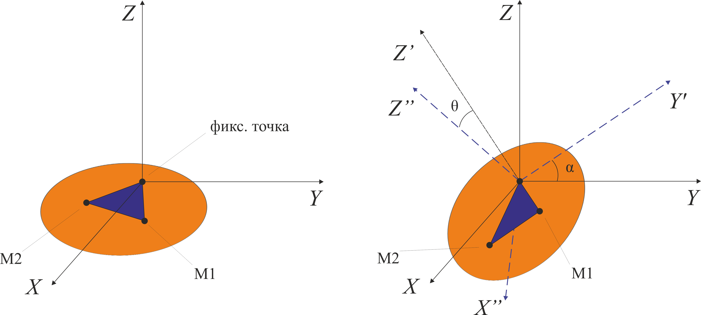
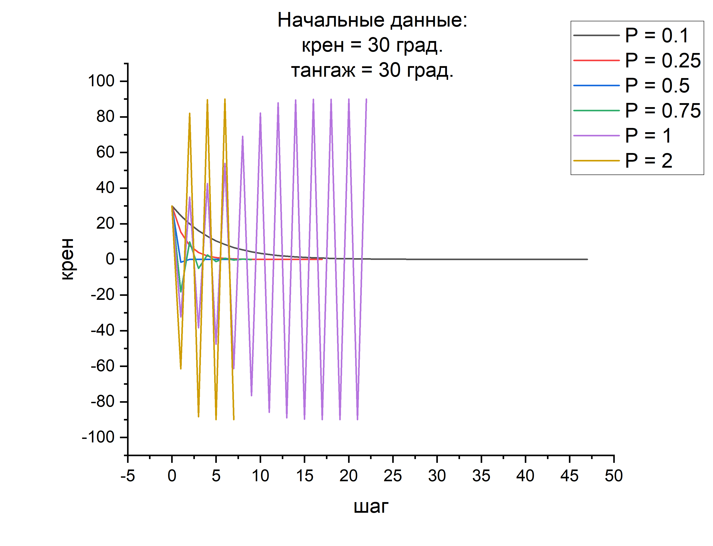
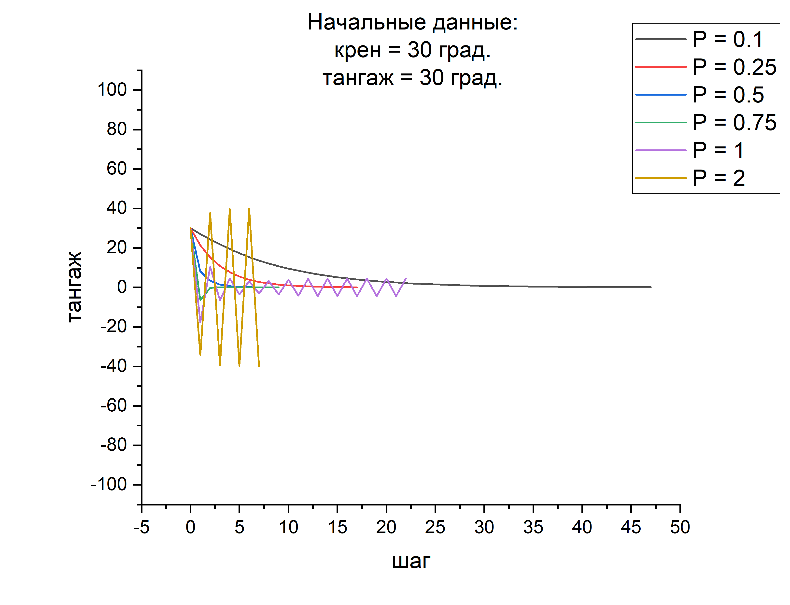
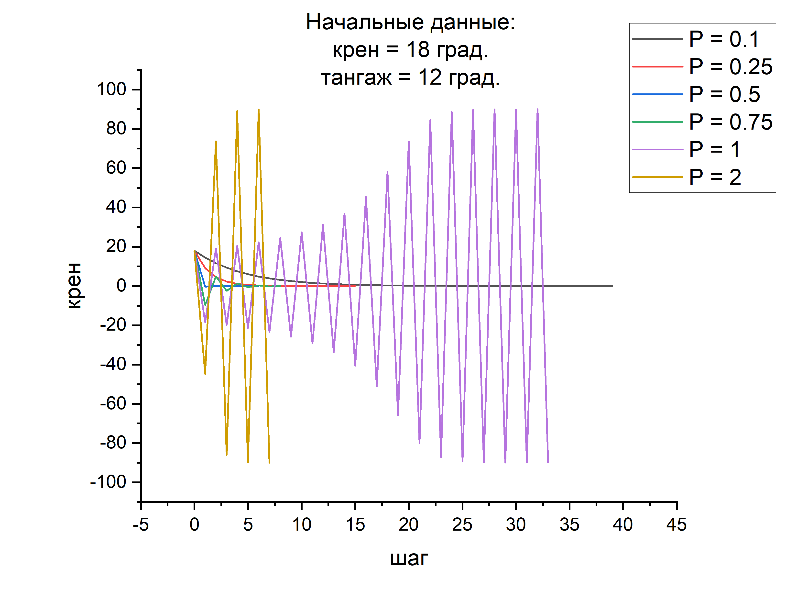
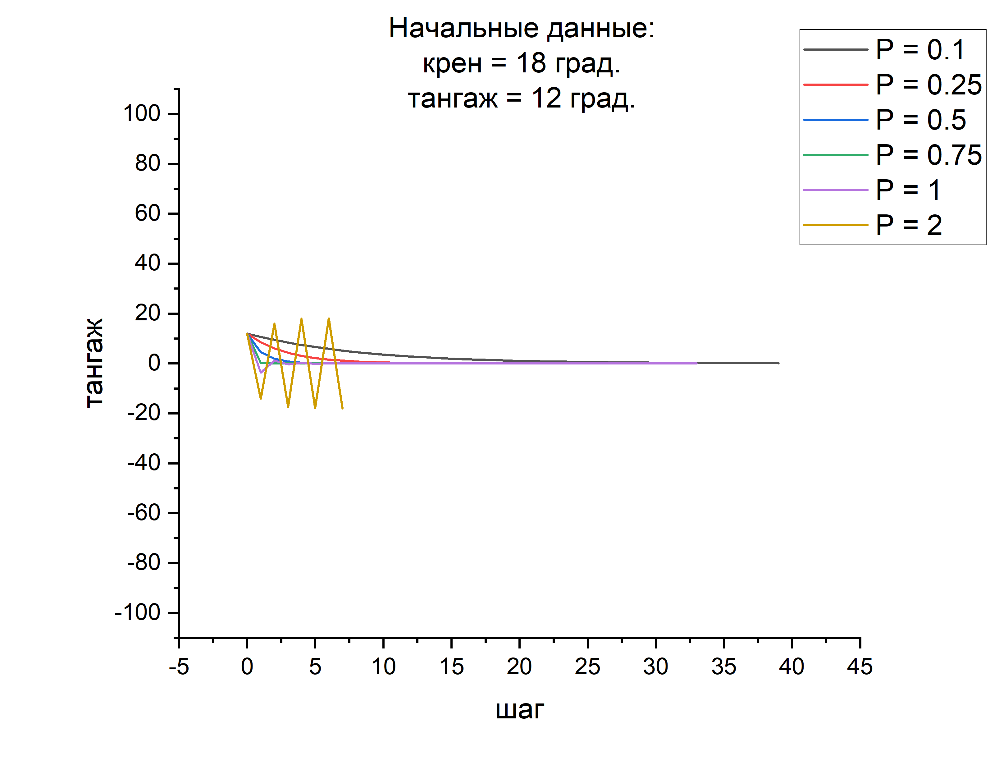

# Стабилизация платформы при помощи шаговых двигателей

Установка изображена на *рис. 1.* Платформа имеет одну фиксированную точку и две точки, в которых закрепляются шаговые двигатели. Стабилизация работает на принципе **P**-регулятора. Шаговые двигатели производят смещение только вдоль вертикальной оси. Данная модель симулирует работу двигателей и подсчитывает количество шагов, необходимых до стабилизации платформы. Модель работает корректно при углах Эйлера меньше $\large 30°$.



  
  <p align="center">
Рис. 1. Схема установки до и после поворота. Оранжевым цветом изображена платформа. Углы Эйлера: крен – $\large α$, тангаж – $\large θ$.
  </p>
	
## Реализация
Программа состоит из 3 классов: *EulerToMistake*, *MistakeToOffset*, *OffsetToEngine*. 
Алгоритм работы: 
1.	На вход класса *EulerToMistake* подаются углы Эйлера, которые описывают поворот платформы. Далее считается ошибка: разность между углами Эйлера и положением равновесия.
2.	Далее ошибка из класса *EulerToMistake* подается на вход класса *MistakeToOffset*. Метод *computeOffset* вычисляет смещения, которые нужно задать двум двигателям. Логика основана на принципе **P**-регулятора.
3.	Далее вызывается класс *OffsetToEngine*, на вход которого подаются смещения для двигателей и текущая ошибка. В классе *OffsetToEngine* симулируется работа двигателей и после смещения двигателей вычисляется ошибка, которая передается обратно классу *MistakeToOffset*. Затем процесс происходит рекурсивно до тех пор, пока платформа не стабилизируется или наоборот, начнет раскачиваться все сильнее.

## Подробнее про реализацию классов и математику 
  ### Класс *EulerToMistake*
Конструктор:

```c++
EulerToMistake(vector<double> euler_coords_t) – на вход подаются углы Эйлера;
```
Методы:
```c++
void computeMistake() – метод, вычисляющий ошибку;
vector<double> getEulerCoords() const – метод, возвращающий углы Эйлера;
vector<double> getMistake() const – метод, возвращающий ошибку;
```
Поля:
```c++
vector<double> euler_coords - углы Эйлера, {крен, тангаж}, положительное направление углов выбирается по правилу правой руки;
vector<double> mistake - ошибка, {крен, тангаж};
``` 
В нашем случае задаются два угла: крен и тангаж, рыскание отсутствует. Крен – поворот плоскости относительно оси $\large X$, тангаж – поворот плоскости относительно $Y’$ (т.е. ось $\large Y$, после поворота системы координат относительно $\large X$). Например, если $\large крен = 90°$, то тангаж будет происходить относительно оси $\large Z$, так как после поворота ось $\large Y’$ будет совпадать с осью $\large Z$. Если $\large крен = 180°$, то ось $\large Y’$ будет совпадать с осью $\large -Y$. 
Положение равновесия считается при углах Эйлера $\large 0°$. Другими словами, ошибка – это отрицательные углы Эйлера. Необходимость создания отдельного класса для получения ошибки заключается в том, что в будущем в этом классе будет реализовываться механизм получения углов Эйлера из датчика.

  ### Класс *MistakeToOffset*
Конструктор:
```c++
MistakeToOffset(vector<double> mistake_t, double P_t, double I_t, double D_t, int step, ostream& output_t) – на вход подаются ошибка, коэффициенты P, I, D, шаг, поток вывода;
```
Методы:
```c++
void computeOffset()– метод, вычисляющий смещение моторов;
vector<double> getOffset() const – метод, возвращающий смещение моторов;
vector<double> getMistake() const – метод, возвращающий ошибку;
```  
Поля:
```c++
vector<double> mistake - ошибка, {крен, тангаж};
double P, I, D - коэффициенты PID-регулятора;
vector<double> offset - смещение на двух моторах;
ostream& output – поток вывода;
int step – шаг стабилизации;
```  
В нашем случае задаются $\large I = 0,D = 0$. Расположение моторов изображено на *рис. 1*. 
Логика вычисления смещения для двух моторов:
  
$$\large М_1 = крен \cdot P - тангаж \cdot P$$
  
$$\large M_2 = - крен \cdot P - тангаж \cdot P$$

Это и есть **P**-регулятор. Например, если заданы крен = $\large 0°$, тангаж = $\large 30°$, то оба двигателя будут делать смещение вниз. Если $\large крен = 30°, тангаж = 0°$, то первый двигатель делает смещение вверх, второй двигатель делает смещение вниз. 
В методе *computeOffset* вычисляются смещения для моторов по формулам выше и вместе с текущей ошибкой передаются на вход класса *OffsetToEngine*. Далее рекурсивно создается класс *MistakeToOffset* и заданы условия, когда рекурсия должна закончиться: если углы Эйлера меньше $\large 0.1°$, то считается, что платформа стабилизировалась; если хотя бы один угол Эйлера достигает $\large 90°$, считается, что стабилизация произошла неудачно. Поле **step** увеличивается на единицу на каждый шаг рекурсии, чтобы понять, сколько требуется шагов для стабилизации. В консоль выводится информация о начальных данных: крен, тангаж, коэффициент **P** и результат стабилизации: успех и количество шагов, или неудача. В текстовый файл записываются данные в формате: *шаг крен тангаж*.

  ### Класс *OffsetToEngine*
  
Конструктор:
```c++
OffsetToEngine(vector<double> offset_t, vector<double> old_mistake) – на вход подаются смещение и текущая ошибка;
```
Методы:
```c++
void computeMatrix(vector<double> mistake) – метод, вычисляющий матрицу поворота;
void OffsetToMistakeModel(vector<double> old_mistake) – метод, вычисляющий ошибку после смещения моторов (модель);
void OffsetToMistake() – метод, вычисляющий ошибку после смещения моторов (истинная ошибка, полученная с датчика; метод пока реализован);
vector<double> getMistake() const – метод, возвращающий ошибку;
Matrix getMatrix() const – метод, возвращающий матрицу поворота;
```  
Поля:
```c++
vector<double> offset - смещение на двух моторах;
vector<double> new_mistake - ошибка, {крен, тангаж};
Matrix matrix – матрица поворота;
```  
Алгоритм работы модели:
1.   Задаем изначальное положение двух точек, к которым крепятся двигатели, так, чтобы они с началом координат составляли равносторонний треугольник (*рис.1*). Длина радиус векторов единичная. Задаем нормаль к платформе в состоянии равновесия.
2.   Вычисляем матрицу поворота, которая поворачивает систему координат, связанную с платформой в положении равновесия, вместе с платформой, т.е. новая система координат будет повернута так, как и платформа.
 
  Матрица поворота вычисляется через произведение двух матриц поворота: матрица $\large A$ задает поворот относительно оси $\large X$, матрица $\large B$ задает поворот относительно оси $\large Y’$. $\large A$ и $\large B$ известны по формулам:
  
$$\large A = \begin{pmatrix}
 1  &0  &0 \\
 0  &\cos{\alpha}  &-\sin{\alpha} \\
 0  &\sin{\alpha}  &\cos{\alpha}
\end{pmatrix},
$$
  
$$\large B = \begin{pmatrix}
 \cos{\theta} + \left( 1-\cos\theta \right)x^{2} &\left( 1-\cos\theta \right)xy-\left( \sin\theta \right)z &\left( 1-\cos\theta \right)xz+\left( \sin\theta \right)y  \\
 \left( 1-\cos\theta \right)yx+\left( \sin\theta \right)z  &\cos{\theta} + \left( 1-\cos\theta \right)y^{2} &\left( 1-\cos\theta \right)yz-\left( \sin\theta \right)x \\
 \left( 1-\cos\theta \right)zx-\left( \sin\theta \right)y  &\left( 1-\cos\theta \right)zy+\left( \sin\theta \right)x &\cos{\theta} + \left( 1-\cos\theta \right)z^{2}
\end{pmatrix},
$$
  

где $\large \alpha$ – угол крена, $\large θ$ – угол тангажа, $\large \overrightarrow{v}=(x,y,z)$ – единичный вектор оси вращения. В нашем случае $\large \overrightarrow{v}$ направлен вдоль оси $\large Y’$. Учитывая это, получаем итоговую матрицу $\large С$:
  
$$ \large
  C=BA=\begin{pmatrix}
 \cos\theta  &0 &\sin\theta  \\
 \sin\theta\sin\alpha  &\cos\alpha &-\sin\alpha\cos\theta  \\
 -\sin\theta\cos\alpha  &\sin\alpha &\cos\alpha\cos\theta
\end{pmatrix}
$$
  
3.	Преобразуем радиус-векторы двух точек в соответствии с поворотом плоскости. Теперь точки у нас находятся там, где и должны быть, если платформа отклонилась от положения равновесия.
  
  Преобразование векторов задается по формуле:
  
  $$ \large
    r'=Cr,
  $$
  
  где $\large r$ – радиус-вектор точки, к которой прикреплен мотор.

4. Задаем смещение двух точек по оси $\large Z$, так как моторы могут двигаться только в этом направлении. После этого нормируем радиус-векторы двух точек, так как их длина изначально единичная. Из-за нормировки, реальное смещение меньше, чем то, что мы изначально задали, но логики процесса это не меняет. При углах меньше $\large 30°$ смещение корректно, так равносторонний треугольник остается равносторонним. 
5. Вычисляем через векторное произведение нормаль новой плоскости, построенной уже по двум смещенным радиус-векторам.
6. Зная нормаль, находим новые углы Эйлера. Здесь алгоритм пока работает только для углов от $\large -90°$ до $\large 90°$.
  
Новые углы Эйлера находятся из решения обратной задачи:

  $$\large 
    n'=Cn,
  $$
  
  где $\large n$ – нормаль платформы в положении равновесия, $\large n’$ – нормаль платформы, смещенной от положения равновесия. Так как $\large n = (0,0,1)$, новые углы Эйлера
 
  $$ \large
        \alpha=\arctan\frac{n'_y}{n'_z}, \theta=-\arcsin n'_x
  $$
  
7.	Новые углы Эйлера возвращаются в класс *MistakeToOffset* и процесс продолжается рекурсивно, пока платформа не стабилизируется.

Новые углы Эйлера возвращаются в класс MistakeToOffset и процесс продолжается рекурсивно, пока платформа не стабилизируется.

## Примеры работы программы

Начальные данные: $\large крен = 30°, тангаж = 30°$.

Вывод в консоль:

```PowerShell
Начальные данные: крен = 30 градусов, тангаж = 30 градусов
P = 0.1
Стабилизация прошла успешно! Количество шагов: 47
P = 0.25
Стабилизация прошла успешно! Количество шагов: 16
P = 0.5
Стабилизация прошла успешно! Количество шагов: 6
P = 0.75
Стабилизация прошла успешно! Количество шагов: 8
P = 1
Стабилизация прошла неудачно!
P = 2
Стабилизация прошла неудачно!
```

<p align="center">
  
</p>
<p align="center">
  
</p>

#

Начальные данные: $\large крен = 18°, тангаж = 12°$.

Вывод в консоль:

```PowerShell
Начальные данные: крен = 18 градусов, тангаж = 12 градусов
P = 0.1
Стабилизация прошла успешно! Количество шагов: 39
P = 0.25
Стабилизация прошла успешно! Количество шагов: 14
P = 0.5
Стабилизация прошла успешно! Количество шагов: 5
P = 0.75
Стабилизация прошла успешно! Количество шагов: 7
P = 1
Стабилизация прошла неудачно!
P = 2
Стабилизация прошла неудачно!
```

<p align="center">
  
</p>

<p align="center">
  
</p>
